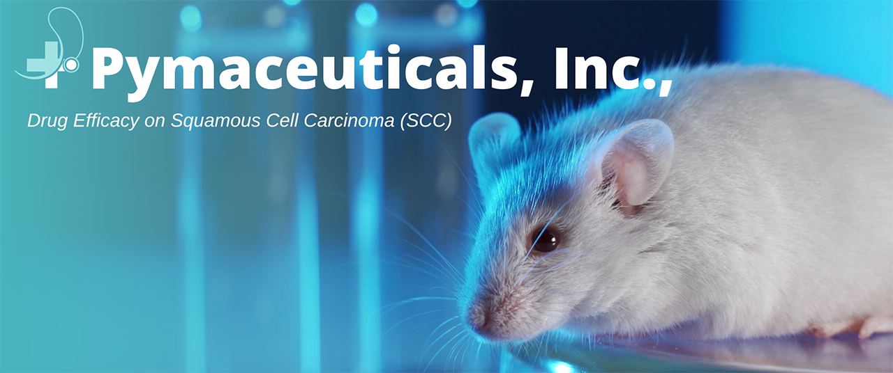
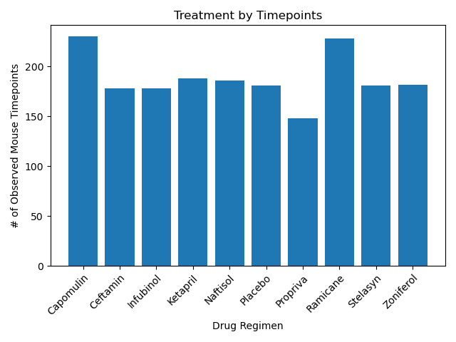
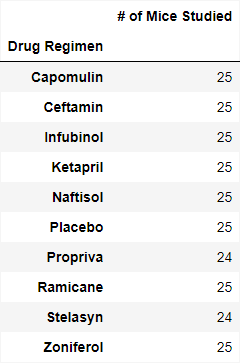
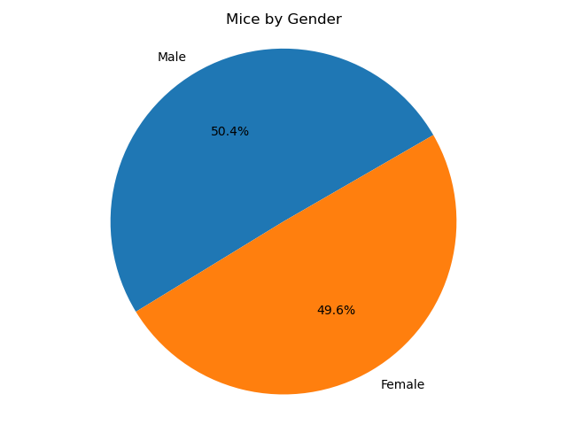
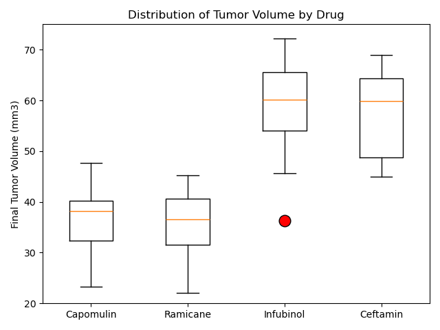
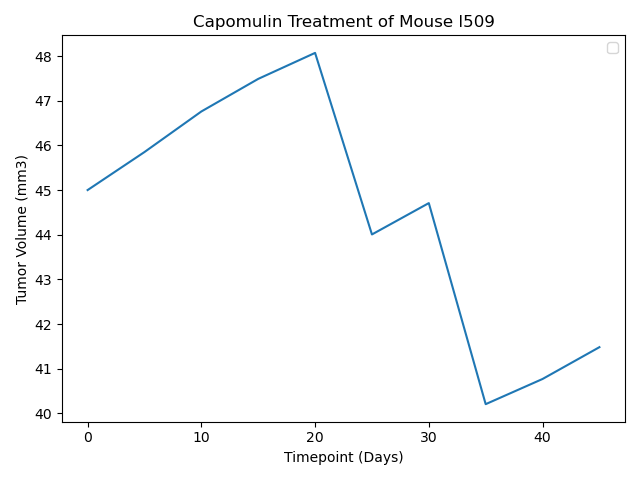
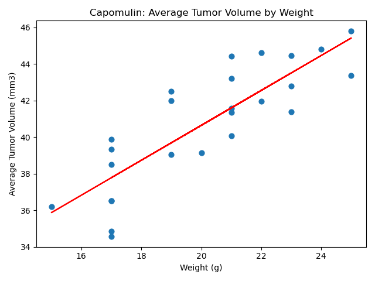

# Module5_Visualization-Challenge
Visualization Challenge - Week 5 - Data Analytics Boot Camp - University of Oregon

## Pymaceuticals Inc. - Background
You've just joined Pymaceuticals, Inc., a new pharmaceutical company that specializes in anti-cancer medications. Recently, it began screening for potential treatments for squamous cell carcinoma (SCC), a commonly occurring form of skin cancer.

As a senior data analyst at the company, you've been given access to the complete data from their most recent animal study. In this study, 249 mice who were identified with SCC tumors received treatment with a range of drug regimens. Over the course of 45 days, tumor development was observed and measured. The purpose of this study was to compare the performance of Pymaceuticals’ drug of interest, Capomulin, against the other treatment regimens.

The executive team has tasked you with generating all of the tables and figures needed for the technical report of the clinical study. They have also asked you for a top-level summary of the study results.

## Instructions
This assignment is broken down into the following tasks:

- Prepare the data.
- Generate summary statistics.
- Create bar charts and pie charts.
- Calculate quartiles, find outliers, and create a box plot.
- Create a line plot and a scatter plot.
- Calculate correlation and regression.
- Submit your final analysis.

---

## Analysis

### Drug Regimen Comparison
Comparing all nine drug treatments, along with placebo, shows that Capomulin and Ramicane had a longer survival rate when compared to the other drugs tested.  The remaining drugs had a similar survival rate as compared to placebo, suggesting that they may be ineffective for treating squamous cell carcinoma (SCC).

### Study Balance
The study maintained a balanced design, testing approximately 25 mice with each drug regimen. This ensures the reliability of our analysis by minimizing potential biases associated with uneven group sizes.

Additionally, we examined the gender distribution of mice in our study and found a nearly identical balance between male and female mice. Based on this balanced sampling, we assume that gender is not a significant factor influencing the study outcomes.

### Data Distribution of Tumor Volume
With Capomulin and Ramicane as the drugs of interest, we examined the distribution of tumor volume in comparison to Infubinol and Ceftamin. Both Capomulin and Ramicane exhibited similar results, showing no outliers. However, a closer look reveals that Capomulin demonstrates more consistent results, as evidenced by closely distributed inner quartile values. Additionally, the distribution of results for Capomulin appears less skewed compared to Ramicane.

### Capomulin Response Sample
We can look closer at the response individual subject (mouse l509) to Capomulin drug treatment.  The tumor volume starts at 45 (mm3) at the beginning of the treatment.  It continues to grow for the first 20 days while the drug is administered, but shows 8% decrease in volume over the remainder of the treatment.

### Capomulin:  Correlation Between Mouse Weight & Average Tumor Volume
There is a strong correlation (.84) between mouse weight and average tumor volume, suggesting that weight of the mouse may impact the effectiveness of Capomulin drug treatment.  This should be considered when evaluating the overall efficacy of the drug.

### Conclusion
Capomulin demonstrates promising outcomes in treating squamous cell carcinoma (SCC) in mice over a 45-day trial.  It is worth noting that Ramicane has also showed similar results.  Further exploration through additional testing of both Capomulin and Ramicane is reccomended to ascertain potential differences in effectiveness. A larger sample size and an extended study duration would contribute valuable insights to better determine the comparative efficacy of these drugs.

 
